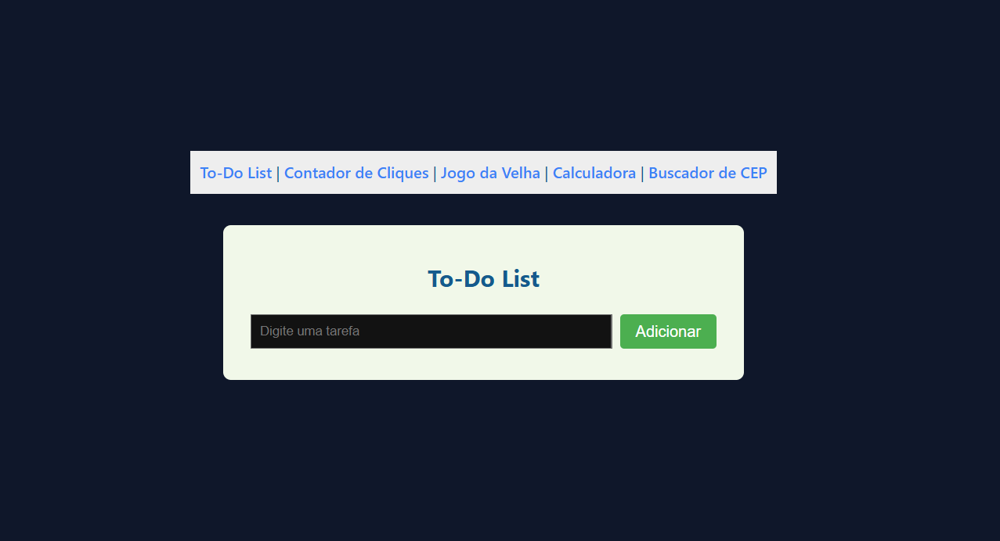

# Projeto React Multifuncional

Este projeto React foi desenvolvido como parte de uma atividade prática, com o objetivo de reunir diversas funcionalidades interativas em um só lugar. O projeto utiliza **ReactJS**, **React Router**, estilização com **tons de azul** e foi publicado online com **Vercel**, após versionamento com **Git e GitHub**.

## Funcionalidades

- ✅ **To-Do List** – Crie, visualize e marque tarefas como concluídas.  
- 🔢 **Contador de Cliques** – Um contador simples com incremento e reset.  
- ❌⭕ **Jogo da Velha** – Clássico jogo da velha para dois jogadores.  
- 🧮 **Calculadora** – Faça operações básicas (soma, subtração, divisão, multiplicação).  
- 📍 **Buscador de CEP** – Encontre informações de endereço a partir do CEP digitado.

## Tecnologias Utilizadas

- [ReactJS](https://reactjs.org/)
- [React Router DOM](https://reactrouter.com/)
- [Vercel](https://vercel.com/) (Deploy)
- [Git e GitHub](https://github.com/)

## Página Inicial

## 👩‍💻 Autores

Desenvolvido com ❤️ por 

  Emily Soares e Matheus Souza.

